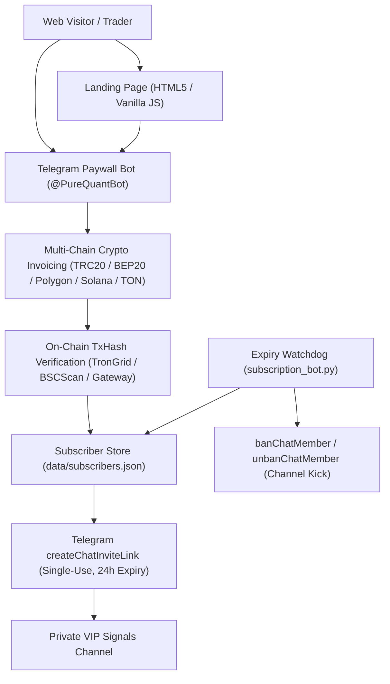
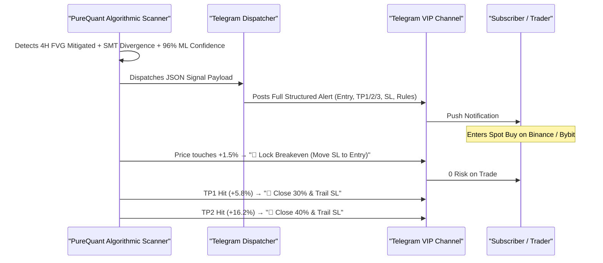

# 🏗️ PureQuant AI — Technical Architecture & Data Flow

This document details the system design, data models, component interactions, and execution lifecycle of **PureQuant AI**.

---

## 🧭 System Overview



---

## 🧩 Core Components

### 1. Frontend: High-Converting Landing Page (`landing_page/index.html`)
* **Styling**: Modern Cyber-Quant aesthetic with deep obsidian palette (`#070a0f`), neon cyan (`#00f2fe`), matrix emerald (`#00f5a0`), glassmorphism, and responsive CSS Grid/Flexbox.
* **Interactive Terminal**: Real-time signal radar terminal previewing 5 pairs (BTC, ETH, SOL, NEAR, RENDER) with ML confidence %, FVG levels, and Breakeven rules.
* **Proof Showcase**: Embedded real trade execution screenshots (`assets/proof_btc.jpg`, `assets/proof_sol.jpg`, `assets/proof_eth.jpg`) highlighting +18.42%, +34.60%, and +22.84% verified spot wins.
* **Pricing Grid**: 3 — 6 — 9 pricing ladder (\$3 Starter, \$6 Pro VIP, \$9 Lifetime VIP).
* **Zero Dependencies**: Pure HTML5, CSS3, and lightweight vanilla JS for instant CDN load times (< 300ms).

### 2. Backend: Telegram Paywall Engine (`subscription_bot.py`)
* **Runtime**: Python 3.9+ with `requests`.
* **State Store**: Persistent atomic JSON ledger in `data/subscribers.json`.
* **Invite Link Generator**: Calls Telegram Bot API `createChatInviteLink` with `member_limit=1` and `expire_date=now + 86400s`.
* **Signal Formatter**: `format_spot_signal_message(setup)` parses trade coordinates, FVG mitigation zones, Lorentzian confidence score, entry/TP/SL targets, and dynamic trailing breakeven rules into HTML-formatted Telegram messages.
* **Watchdog Service**: `check_expirations()` evaluates active subscriber records and revokes expired memberships via `banChatMember` + `unbanChatMember`.

---

## 🗄️ Data Model (`data/subscribers.json`)

```json
{
  "123456789": {
    "user_id": "123456789",
    "username": "cryptotrader_alex",
    "plan": "lifetime_vip",
    "plan_name": "Lifetime VIP Pass (One-Time)",
    "amount_paid": 9.0,
    "tx_hash": "0x4f8b9e2c1a3d5e7f8a9b0c1d2e3f4a5b6c7d8e9f0a1b2c3d4e5f6a7b8c9d0e1f",
    "joined_at": "2026-08-24 16:30:00",
    "expires_at": "2036-08-21 16:30:00",
    "is_active": true,
    "invite_link": "https://t.me/+AbCdEfGhIjKlMnOp",
    "revoked_at": null
  }
}
```

---

## 🔄 Signal Execution & Capital Defense Protocol


