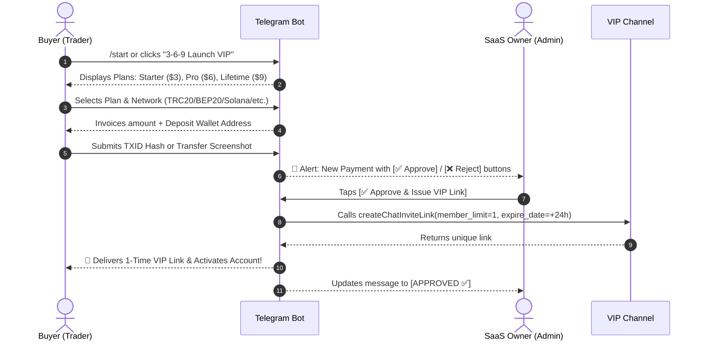

# 🚀 PureQuant AI — Complete Telegram Bot & Dual Channel Setup Guide

> **Step-by-Step Blueprint**: How to build your **Free Public Channel**, **VIP Private Channel**, and **Interactive Crypto Paywall Bot** with 100% automated single-use invite links.

---

## 🧭 1. What to Make First: Order of Operations

Follow this exact sequence to avoid circular dependencies:

```
┌────────────────────────────┐
│ 1. Create Telegram Bot     │  Message @BotFather ➔ Get BOT_TOKEN
└─────────────┬──────────────┘
              │
              ▼
┌────────────────────────────┐
│ 2. Create Public Channel   │  "PureQuant AI | Free Signals" (Public)
└─────────────┬──────────────┘
              │
              ▼
┌────────────────────────────┐
│ 3. Create VIP Channel      │  "PureQuant AI | VIP Institutional" (Private)
└─────────────┬──────────────┘
              │
              ▼
┌────────────────────────────┐
│ 4. Add Bot as Admin        │  Grant permissions to Free & VIP channels
└─────────────┬──────────────┘
              │
              ▼
┌────────────────────────────┐
│ 5. Get IDs & Fill .env     │  Channel IDs (-100...) + Admin User ID + Wallets
└─────────────┬──────────────┘
              │
              ▼
┌────────────────────────────┐
│ 6. Launch Bot Backend      │  Run `python3 subscription_bot.py`
└────────────────────────────┘
```

---

## 🤖 STEP 1: Create Your Telegram Bot via `@BotFather`

1. Open Telegram and search for [@BotFather](https://t.me/BotFather) (verified bot with blue checkmark).
2. Click **Start** or send `/start`.
3. Send `/newbot`.
4. Choose a name: `PureQuant AI Paywall` (or `PureQuant Official Bot`).
5. Choose a unique username ending in `bot`: (e.g., `PureQuantPayBot` or `PureQuantSaaSBot`).
6. **Save your HTTP API Token**:
   ```
   1234567890:ABCdefGHIjklMNOpqrsTUVwxyz
   ```
7. *(Optional Branding)*:
   - Send `/setdescription` to set the welcome intro.
   - Send `/setuserpic` to upload the PureQuant logo.
   - Send `/setabouttext` to write a 1-sentence bio.

---

## 📢 STEP 2: Create the Free Public Channel

This channel acts as your **Top-of-Funnel Lead Magnet** to build trust and funnel users into paid VIP.

1. In Telegram, click **New Channel** (or Pen icon ➔ *New Channel*).
2. **Channel Name**: `PureQuant AI | Free Crypto Spot Signals`
3. **Description**:
   ```
   ⚡ Institutional Quantitative Spot Intelligence (100% Spot, Zero Leverage).
   📊 Powered by Lorentzian Distance ML & Fair Value Gap (FVG) Engine.
   💎 Upgrade to VIP ($3-$6/mo): @YourBotUsername
   🌐 Web: https://purequant.ai
   ```
4. **Channel Type**: Select **Public Channel**.
5. **Public Link**: Pick an easy handle (e.g., `t.me/PureQuantSignals` or `t.me/PureQuantFree`).
6. **Add Administrator**:
   - Go to Channel Settings ➔ **Administrators** ➔ **Add Admin**.
   - Search for your bot username (`@YourBotUsername`).
   - Grant Permission: **Post Messages** ✅.

---

## 💎 STEP 3: Create the VIP Private Channel

This is your **Exclusive Paid Channel** where full confluences and 24/7 Grade A+ signals are posted.

1. Click **New Channel**.
2. **Channel Name**: `PureQuant AI | VIP Institutional Alpha`
3. **Description**:
   ```
   💎 Institutional Grade A+ Spot Setups, Lorentzian ML Scores, Dynamic Trailing SL & Breakeven Locks.
   🔒 Private Access Only.
   ```
4. **Channel Type**: Select **Private Channel**.
   > ⚠️ **CRITICAL**: Do **NOT** share the default private link publicly! The bot will automatically generate unique, single-use 24-hour links for paying users.
5. **Add Administrator**:
   - Go to Channel Settings ➔ **Administrators** ➔ **Add Admin**.
   - Search for your bot (`@YourBotUsername`).
   - Grant the following essential permissions:
     - **Invite Users via Link**: **ON ✅** *(Required to generate 1-time invite links)*
     - **Post Messages**: **ON ✅** *(Required for signal alerts)*
     - **Ban/Remove Members**: **ON ✅** *(Required to revoke expired 30-day subscribers)*

---

## 🔍 STEP 4: Get Channel IDs & Your Admin User ID

Telegram channels have a unique negative ID starting with `-100`.

### Option A: Find Channel IDs via `@JsonDumpBot` or `@userinfobot`
1. Forward any message from your **VIP Channel** and **Free Channel** to [@JsonDumpBot](https://t.me/JsonDumpBot) or [@userinfobot](https://t.me/userinfobot).
2. Look for `forward_from_chat` ➔ `id` (e.g., `-1002345678901`).

### Option B: Find Your Personal Admin Telegram User ID
1. Send `/start` to [@userinfobot](https://t.me/userinfobot).
2. It will reply with your numeric `Id:` (e.g., `987654321`). This is your `ADMIN_TELEGRAM_ID`.

---

## ⚙️ STEP 5: Configure `.env` File

Copy `.env.example` to `.env` and enter your credentials:

```bash
cp .env.example .env
nano .env
```

Fill in your actual values:

```ini
# Bot API Token from @BotFather
SAAS_BOT_TOKEN="1234567890:ABCdefGHIjklMNOpqrsTUVwxyz"

# Channel IDs (include the -100 prefix)
VIP_CHANNEL_ID="-1002345678901"
FREE_CHANNEL_ID="-1009876543210"
FREE_CHANNEL_USERNAME="PureQuantSignals"

# Admin & Support Info
ADMIN_TELEGRAM_ID="987654321"
SUPPORT_USERNAME="@PureQuantSupport"

# Non-Custodial Receiving Wallets (USDT / USDC)
USDT_TRC20_WALLET="TXxxxxxxxxxxxxxxxxxxxxxxxxxxxxxx"
USDT_BEP20_WALLET="0x1234567890123456789012345678901234567890"
USDT_POLYGON_WALLET="0x1234567890123456789012345678901234567890"
USDT_SOLANA_WALLET="YourSolanaWalletAddressHere"
USDT_TON_WALLET="UQYourTonWalletAddressHere"
```

---

## 💳 STEP 6: How the Crypto Paywall Verification Flow Works



### 🔐 Security Highlights:
1. **Single-Use Links**: Each invite link allows **exactly 1 join** and expires in 24 hours. Buyers cannot forward or share links with friends.
2. **Automated Expiry Watchdog**: Runs every 10 minutes. When a 30-day monthly plan expires, the bot revokes VIP channel access and sends a renewal reminder.
3. **100% Non-Custodial**: All funds go directly into your personal hardware/software cold wallet with zero third-party payment gateway fees or KYC delays.

---

## 🚀 STEP 7: Run & Test the Bot

### Local Test Run:
```bash
python3 subscription_bot.py
```

### Production 24/7 VPS Deployment (PM2):
```bash
npm install -g pm2
pm2 start subscription_bot.py --name "purequant-paywall" --interpreter python3
pm2 save
pm2 startup
```

---

## 📊 Summary of Active Pricing Plans

| Plan Key | Tier Name | Price | Validity | Highlights |
| :--- | :--- | :--- | :--- | :--- |
| `starter` | **Starter Spot** | **\$3.00** / mo | 30 Days | 24/7 Spot Alerts, Entry/TP/SL, 100% Halal |
| `pro` | **Pro VIP AI** | **\$6.00** / mo | 30 Days | Lorentzian ML, FVG Radar, Trailing Breakeven |
| `lifetime_vip`| **Lifetime VIP Pass** | **\$9.00** one-time | 10 Years | Unlimited VIP, All Future V2 Upgrades Free |

---

*PureQuant AI Quantitative Execution Engine — All rights reserved.*
